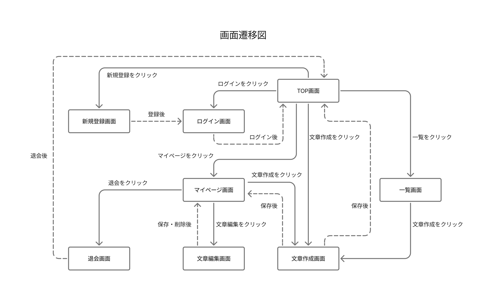
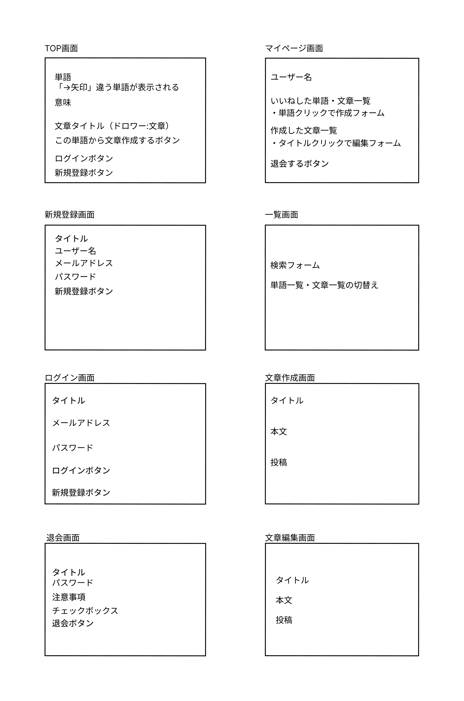
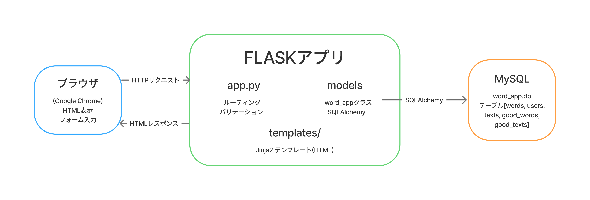
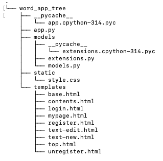

# 基本設計(仮名：美しい日本語WEBアプリ)

 

1. [画面一覧・画面遷移図](#chapter1)
1. [ワイヤーフレーム](#chapter2)
1. [DB設計](#chapter3)
1. [UR設計(ルーティング)](#chapter4)
1. [システム構成図](#chapter5)
1. [データフロー](#chapter6)
1. [フォルダ構成](#chapter7)
1. [共通仕様](#chapter8)

 

## 1.画面一覧・画面遷移図
### 画面一覧
|No|画面名|概要|
|:---:|:---:|:---:|
|1|TOP画面|単語・意味を表示 文章タイトルを表示(ドロワーで本文を表示)|
|2|ログイン画面|メールアドレスとパスワードを入力するフォームを表示|
|3|新規登録画面|メールアドレスとパスワード、ユーザー名を入力するフォームを表示|
|4|退会画面|パスワード入力フォームとチェックボックスを表示|
|5|一覧画面|検索フォームを表示 単語・文章を切り替えると対応した一方の一覧を表示|
|6|マイページ画面|いいねした単語・文章一覧と投稿した文章一覧を表示|
|7|文章作成画面|タイトルと本文を入力するフォームを表示|
|8|文章編集画面|既存のタイトルと本文を修正するフォームを表示|

### 画面遷移図

 

## 2.ワイヤーフレーム

 

## 3.DB設計(テーブル定義・ER図)

### テーブル名(words)
|カラム名|データ型|制約|説明|
|:---:|:---:|:---:|:---:|
|id|int|primarykey,auto_increment|単語ID(主キー)、自動インクリメント|
|word|varchar(50)|notnull,複合unique(read)|単語|
|reading|varchar(50)|notnull,複合unique(word)|ふりがな|
|mean|text|notnull|単語の意味|

### テーブル名(genres)
|カラム名|データ型|制約|説明|
|:---:|:---:|:---:|:---:|
|id|int|primarykey,auto_increment|ジャンルID (主キー)、自動インクリメント|
|genre|varchar(50)|notnull,unique|ジャンル|

### テーブル名(word_genres)
|カラム名|データ型|制約|説明|
|:---:|:---:|:---:|:---:|
|id|int|primarykey,auto\_increment|単語ジャンルID (主キー)、自動インクリメント|
|word_id|int|foreignkey,notnull|単語ID(wordsテーブルのid)|
|genre_id|int|foreignkey,notnull|ジャンルID(genresテーブルのid)|

### テーブル名(users)
|カラム名|データ型|制約|説明|
|:---:|:---:|:---:|:---:|
|id|int|primarykey,auto\_increment|ユーザーID(主キー)、自動インクリメント|
|email|varchar(255)|notnull,unique|メールアドレス|
|password_hash|varchar(255)|notnull,hashkey|パスワード|
|user_name|varchar(255)|notnull|ユーザー名(255文字以内)|

### テーブル名(texts)
|カラム名|データ型|制約|説明|
|:---:|:---:|:---:|:---:|
|id|int|primarykey,auto_increment|文章ID(主キー)、自動インクリメント|
|user_id|int|foreignkey,notnull|文章を作成したユーザーID(usersテーブルのid)|
|title|varchar(255)|notnull|文章のタイトル(255文字以内)|
|main_text|text|notnull|文章の本文|
|text_status|int|notnull|文章の公開ステータス(0:公開、1:非公開(下書き))|
|word|int|foreignkey,notnull|文章中必須単語|

### テーブル名(good_words)
|カラム名|データ型|制約|説明|
|:---:|:---:|:---:|:---:|
|id|int|primarykey,auto_increment|単語いいねID (主キー)自動インクリメント|
|word_id|int|foreignkey,notnull,複合unique(user_id)|いいねされた単語ID(wordsテーブルのid)|
|user_id|int|foreignkey,notnull,複合unique(word_id)|いいねしたユーザーID(usersテーブルのid)|

### テーブル名(good_texts)
|カラム名|データ型|制約|説明|
|:---:|:---:|:---:|:---:|
|id|int|primarykey,auto_increment|文章いいねID (主キー)、自動インクリメント|
|text_id|int|foreignkey,notnull,複合unique(user_id)|いいねされた文章ID(textsテーブルのid)|
|user_id|int|foreignkey,notnull,複合unique(text_id)|いいねしたユーザーID(usersテーブルのid)|

 

### ER図

 

## 4.URL設計(ルーティング)

|No|URL|メソッド|処理内容|
|:---:|:---:|:---:|:---:|
|1|/|GET|単語の意味を表示 文章タイトルを表示(ドロワーで本文を表示)|
|2|/login|GET|ログイン画面を表示|
|3|/login|POST|ログインに成功したらTOP画面にリダイレクト|
|4|/register|GET|ユーザーの新規登録画面を表示|
|5|/register|POST|新規ユーザーを登録し、ログイン画面へリダイレクト|
|6|/mypage/\<id>|GET|いいねした文章・単語、投稿した文章一覧を表示|
|7|/logout|GET|セッションを切断し、TOP画面へリダイレクト|
|8|/unregister|GET|ユーザーの退会画面を表示|
|9|/unregister|POST|ユーザーのデータを削除し、TOP画面へリダイレクト|
|10|/contents|GET|一覧画面を表示、絞り込み検索|
|11|/text-new|GET|文章作成画面を表示|
|12|/text-new|POST|文章を公開/非公開で登録し、マイページ画面へリダイレクト|
|13|/text-edit/\<id>|GET|文章編集画面を表示|
|14|/text-edit/\<id>|POST|文章を公開/非公開で更新し、マイページ画面へリダイレクト|
|15|/text-delete/\<id>|POST|文章を削除し、マイページ画面へリダイレクト|

 

## 5.システム構成図

 

## 6.データフロー

### ユーザーの新規登録をする場合
1.ユーザーが新規登録フォームユーザー名、メールアドレス、パスワードを入力し「新規登録」をクリック  
2.ブラウザがPOST /registerへリクエストを送信  
3.Flaskがリクエストを受け取り、メールアドレス・パスワードの入力チェックを行う  
　　・同じメールアドレスがある、パスワードが8文字以下  
　　　→エラーメッセージをフラッシュし、新規登録フォームにリダイレクト  
　　・入力チェッククリア→次のステップへ  
4.SQLAlchemyを通じてMySQLのusersテーブルにINSERTする  
5.FLASKがログイン画面へリダイレクトを返す  
6.ブラウザがGET /loginへのリクエストを送信  
7.ブラウザがログイン画面を表示する  

 

## 7.フォルダ構成

 

## 8.共通仕様

### フラッシュメッセージ
|タイミング|メッセージ|
|:---:|:---:|
|ログイン成功|「ログインしました」|
|ログイン失敗|「ログインに失敗しました」|
|ログアウト時|「ログアウトしました」|
|新規登録成功|「新規登録が完了しました」|
|新規登録失敗|「既に登録済みのメールアドレスか不正なメールアドレスです」|
|新規登録失敗(パスワード)|「パスワードは8文字以上16文字以内で入力してください」|
|新規登録失敗(ユーザー名)|「ユーザー名は255文字以内で入力してください」|
|新規登録失敗(未入力)|「全ての項目を正しく入力してください」|
|退会|「退会が完了しました」|
|文章公開|「文章を投稿しました」|
|文章削除|「文章を削除しました」|
|タイトル未入力|「タイトルを入力してください」|
|タイトル文字数超過|「タイトルは255文字以内で入力して下さい」|
|本文未入力|「本文を入力してください」|
|本文文字数エラー|「本文は10文字以上、４００字以内で入力してください」|
|タイトル・本文重複|「タイトルと本文が同一の文章が既に存在します。この文章は非公開として保存されます。」|

### エラー処理
・存在しないIDへのアクセスがされた場合は404エラーページを返す  
・新規登録でのエラー発生時は登録せずリダイレクトする(フォームに情報を残さない)  
・文章投稿・編集のエラー発生時はフラッシュメッセージのみで公開/非公開処理を行わず、リダイレクトもしない  

### PRGパターン
二重送信を防ぐため、POST(ログイン、ログアウト、新規登録、退会、文章公開/非公開、文章削除)の処理後はGETへリダイレクトする