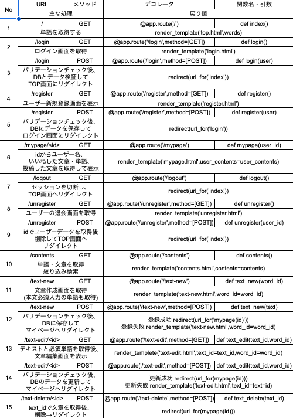

# 詳細設計(仮名：美しい日本語WEBアプリ)

 

1. [画面詳細設計](#chapter1)
1. [バリデーション仕様](#chapter2)
1. [モデル設計](#chapter3)
1. [処理フロー](#chapter4)
1. [テンプレート設計](#chapter5)
1. [エラー処理詳細](#chapter6)
1. [ルーティング・ビュー関数設計](#chapter7)

 

## 1.画面詳細設計

|画面名|要素名|HTMLタグ|主な属性|備考|
|:---:|:---:|:---:|:---:|:---:|
|TOP画面|単語|p|-|ランダムな単語を表示|
||次へボタン|a|href="/"|TOP画面を再表示し、ランダムな単語・意味・文章を表示|
||意味|p|-|単語の意味を表示|
||文章タイトル|button|type="button"|クリックするとドロワーが開き本文を表示|
||文章本文（ドロワー）|div|-|初期状態は非表示|
||文章作成ボタン|a|href="/text-new"|ログイン済みは文章作成画面、未ログインはログイン画面へ遷移|
||新規登録ボタン|a|href="/register"|新規登録画面へ遷移|
||ログインボタン|a|href="/login"|ログイン画面へ遷移|
|ログイン画面|ログインフォーム|form|action="/login" method="POST"|ログイン情報を送信|
||画面タイトル|h1|-|ログインを表示|
||メールアドレス|input|type="email" name="email" maxlength="255" required|メールアドレスを入力|
||パスワード|input|type="password" name="password" minlength="8" maxlength="16" required|パスワードを入力（8文字以上、16文字以内|
||ログインボタン|button|type="submit"|認証成功後、TOP画面へリダイレクト|
|新規登録画面|新規登録フォーム|form|action="/register" method="POST"|新規登録情報を送信|
||画面タイトル|h1|-|新規登録を表示|
||ユーザー名|input|type="text" name="user\_name" maxlength="255" required|ユーザー名を入力|
||メールアドレス|input|type="email" name="email" maxlength="255" required|メールアドレスを入力|
||パスワード|input|type="password" name="password" minlength="8" maxlength="16" required|パスワードを入力（8文字以上、16文字以内）|
||新規登録ボタン|button|type="submit"|登録成功後、ログイン画面へリダイレクト|
|退会画面|退会フォーム|form|action="/unregister" method="POST"|退会処理を送信|
||画面タイトル|h1|-|退会を表示|
||注意事項|p|-|退会するとアカウントおよび投稿した文章が削除されることを表示|
||パスワード|input|type="password" name="password" minlength="8" maxlength="16" required|本人確認のため入力|
||退会確認チェックボックス|input|type="checkbox" name="confirm" required|退会に同意することを確認|
||退会ボタン|button|type="submit"|退会処理成功後、TOP画面へリダイレクト|
|一覧画面|検索フォーム|`<form>`|onsubmit="return false;"|ページ遷移制約|
||検索入力欄|`<input type="search">`|id="search_input"|キーワード入力(単語・意味から部分一致で即時結果反映。デフォルトは空欄)|
||ジャンル検索ボタン|`<button>`|id="genre_list_btn"|クリックでジャンル一覧表示(遷移なし)、単語選択時のみ表示|
||各ジャンル|`<li>` `<button>`|type="button" class="genre_btn"|複数選択可能。単語にのみ有効|
||単語/文章切替ボタン|`<button>`|class="toggle_btn"|単語/文章の一覧を切り替える。デフォルトは単語|
||ソート選択|`<select>`|id="sort_select"|プルダウンで表示。50音昇降順、いいね数が多い順、文章の作成日時昇降順(文章idで実装)|
||一覧・検索結果|`<ul>`|id="list_container"|検索結果を表示。デフォルトは単語の一覧|
||単語|`<li>`|class="word_item"|単語、ふりがな、意味、いいねボタン、文章作成ボタンを表示|
||文章|`<li>`|class="text_item"|タイトル、本文冒頭、いいねボタンを表示。クリックで本文のドロワーが開く|
||ドロワー|`
`|id="drawer"|文章本文を表示|
||結果なしメッセージ|`
`|id="no\_result"|検索結果が0件の場合に「該当する内容がありません」を表示|
|マイページ|ニックネーム|`
`|class="user_name"|{{user.user_name}}を表示|
||いいね一覧|`<ul>`|id="liked_list"|単語・文章双方|
||いいね単語|`<li>`|class="good_word_item"|単語、ふりがな、意味、いいねボタン、文章作成ボタンを表示|
||いいね文章|`<li>`|class="good\_text\_item"|タイトル、本文冒頭、いいねボタンを表示。クリックで本文のドロワーが開く|
||作成した文章一覧|`<ul>`|id="my_texts_list"||
||作成した文章|`<li>`|class="my\_text\_item"|タイトル、本文冒頭、編集・削除ボタン(編集画面へ遷移)、いいね数、公開・非公開ステータスを表示。クリックで本文のドロワーが開く|
||ドロワー|`
`|id="drawer"|いいね・作成した文章の本文をクリックで表示(共通)|
||退会|`<a>`|href="/unregister"|退会画面へ遷移|
|文章作成画面|作成フォーム|`<form>`|action="/text_new" method="post"|POST先|
||タイトル入力欄|`<input>`|type="text" name="title" required|入力必須|
||本文入力欄|`<textarea>`|name="main_text" required|入力必須|
||投稿(公開)ボタン|`<button>`|type="submit" name="text_status" value="0"|フォーム送信|
||下書き(非公開)ボタン|`<button>`|type="submit" name="text_status" value="1"|フォーム送信|
||キャンセルリンク|`<a>`|href="/" href="/mypage"|前画面(TOP画面かマイページ)へ戻る|
|文章編集画面|編集フォーム|`<form>`|action="/text_edit/{{[text.id](http://text.id)}}" method="post"| POST先|
||タイトル入力欄|`<input>`|type="text" name="title" value="{{text.title}}" required|入力必須|
||本文入力欄|`<textarea>`|name="main_text" required|入力必須 {{text.main_text}}で本文表示|
||投稿(公開)ボタン|`<button>`|type="submit" name="text_status" value="0"|フォーム送信|
||下書き(非公開)ボタン|`<button>`|type="submit" name="text_status" value="1"|フォーム送信|
||削除フォーム|`<form>`| action="/text_delete/{{[text.id](http://text.id)}}" method="post"|getでは実行しない|
||削除ボタン|`<button>`|type="submit"|確認あり|
||キャンセルリンク|`<a>`|href="/mypage"|マイページへ戻る|

 

## 2.バリデーション仕様

|画面|フィールド|チェック内容|エラー条件|エラーメッセージ|エラー時の挙動|
|:---:|:---:|:---:|:---:|:---:|:---:|
|新規登録|メールアドレス|必須チェック|メールアドレスが未入力|「全ての項目を正しく入力してください」|/registerにリダイレクト|
||メールアドレス|重複チェック|メールアドレスがDB内に既に存在している|「既に登録済みのメールアドレスか不正なメールアドレスです」|/registerにリダイレクト|
||メールアドレス|形式チェック|メールアドレスの形式が違う|「既に登録済みのメールアドレスか不正なメールアドレスです」 |/registerにリダイレクト|
||パスワード|文字数チェック|パスワードの文字数が8文字未満もしくは16文字以上|「パスワードは8文字以上16文字未満で入力してください」|/registerにリダイレクト|
||パスワード|必須チェック|パスワードが未入力|「全ての項目を正しく入力してください」|/registerにリダイレクト|
||ユーザー名|必須チェック|ユーザー名が未入力|「全ての項目を正しく入力してください」|/registerにリダイレクト|
||ユーザー名|文字数チェック|ユーザー名が255文字以上|「ユーザー名は255文字以内で入力してください」|/registerにリダイレクト|
|ログイン|メールアドレス|必須チェック|メールアドレスが未入力|「全ての項目を正しく入力してください」|/loginにレンダリング|
||メールアドレス|整合性チェック|メールアドレスが違う|「ログインに失敗しました」|/loginにレンダリング|
||パスワード|必須チェック|パスワードが未入力|「全ての項目を正しく入力してください」|/loginにレンダリング|
||パスワード|整合性チェック|パスワードが違う|「ログインに失敗しました」|/loginにレンダリング|
|文章作成画面|タイトル|必須チェック|タイトルが未入力|「タイトルを入力してください」|/text-newにレンダリング|
||タイトル|文字数チェック|タイトルが255文字以上|「タイトルは255文字以内で入力してください」|/text-newにレンダリング|
||本文|必須チェック|文章が未入力|「本文を入力してください」|/text-newにレンダリング|
||本文|文字数チェック|文字数が10文字以下、もしくは400字以上|「本文は10文字以上、４００字以内で入力してください」 |/text-newにレンダリング|
||タイトル・本文|重複チェック|タイトル・本文がDB内に既に存在している|「タイトルと本文が同一の文章が既に存在します。この文章は非公開として保存されます。」|ステータスを非公開にして/mypage/\<id>にリダイレクト|
|文章編集画面|タイトル|必須チェック|タイトルが未入力|「タイトルを入力してください」|/text-edit/\<id>にレンダリング|
||タイトル|文字数チェック|タイトルが255文字以上|「タイトルは255文字以内で入力してください」|/text-edit/\<id>にレンダリング|
||本文|必須チェック|文章が未入力|「本文を入力してください」|/text-edit/\<id>にレンダリング|
||本文|文字数チェック|文字数が10文字以下、もしくは400字以上|「本文は10文字以上、４００字以内で入力してください」|/text-edit/\<id>にレンダリング|
||タイトル・本文|重複チェック|タイトル・本文がDB内に既に存在している|「タイトルと本文が同一の文章が既に存在します。この文章は非公開として保存されます。」|ステータスを非公開にして/mypage/\<id>にリダイレクト|

 

## 3.モデル設計

必須モジュール  
from sqlalchemy  
import Colmn,ForeignKey,UniqueConstraint,Integer,String  
from sqlalchemy.orm  
declarative\_base,relationship  

### wordsテーブル

|項目|値|
|:---:|:---:|
|クラス名|Word|
|テーブル名|words|

|カラム名|SQLAlchemyの型|制約・オプション|説明|
|:---:|:---:|:---:|:---:|
|id|Integer|primary_key=True autoincrement=True|主キー、自動採番|
|word|String(50)|nullable=False|単語|
|reading|String(50)|nullable=Flase|ふりがな|
|mean|Text|nullable=Flase| 単語の意味|
|-|複合ユニークキー|__table_args__ = UniqueConstraint('word','reading',name='unique_word')|複合ユニークキー|
|genres|リレーション|relationship('Word_genre',back_populates='words')|登録されているジャンルを取得|
|goods|リレーション|relationship('Good_word')|いいね数を取得|

### genresテーブル

|項目|値|
|:---:|:---:|
|クラス名|Genre|
|テーブル名|genres|

|カラム名|SQLAlchemyの型|制約・オプション|説明|
|:---:|:---:|:---:|:---:|
|id|Integer|primary_key=True autoincrement=True|主キー、自動採番|
|genre|String(50)|nullable=False unique=True|ジャンル|
|word_genres|リレーション|relationship('word\_genre',back\_populates="genre")|ジャンルから単語を取得|

### word\_genresテーブル

|項目|値|
|:---:|:---:|
|クラス名|Word_genre|
|テーブル名|word_genres|

|カラム名|SQLAlchemyの型|制約・オプション|説明|
|:---:|:---:|:---:|:---:|
|id|Integer|primary_key=True autoincrement=True|主キー、自動採番|
|word_id|Integer|ForeignKey('words.id')|単語ID(wordsテーブルのid)|
|genre_id|Integer|ForeignKey('genres.id')|ジャンルID(genresテーブルのid)|
|genre|リレーション|relationship('Genre',back_populates='word_genres')|ジャンル名を取得|
|words|リレーション|relationship('Word',back_populates='genres')|登録されている単語を取得|

### usersテーブル

|項目|値|
|:---:|:---:|
|クラス名|User|
|テーブル名|users|

|カラム名|SQLAlchemyの型|制約・オプション|説明|
|:---:|:---:|:---:|:---:|
|id|Integer|primary_key=True autoincrement=True|主キー、自動採番|
|email|String(255)|nullable=Flase unique=True|メールアドレス|
|password_hash|String(255)|nullable=False|ハッシュ化されたパスワード|
|user_name|String(255)|nullable=False|ユーザー名|
|texts|リレーション|relationship('Text')|ユーザーが作成した文章を取得|

### textsテーブル

|項目|値|
|:---:|:---:|
|クラス名|Text|
|テーブル名|texts|

|カラム名|SQLAlchemyの型|制約・オプション|説明|
|:---:|:---:|:---:|:---:|
|id|Integer|primary\_key=True autoincrement=True|主キー、自動採番|
|user_id|Integer|ForeignKey('users.id')|文章を作成したユーザーID (usersテーブルのid)|
|title|String(255)|nullable=False|文章のタイトル(255文字以内)|
|main_text|Text|nullable=False|文章の本文|
|text_status|Integer|nullable=False|文章の公開ステータス(0:公開、1:非公開(下書き))|
|word|Integer|ForeignKey('words.id'),nullable=False|文章中必須単語|
|goods|リレーション|relationship('Good_text')|いいね数を取得|

### good_wordsテーブル

|項目|値|
|:---:|:---:|
|クラス名|Good_word|
|テーブル名|good_words|

|カラム名|SQLAlchemyの型|制約・オプション|説明|
|:---:|:---:|:---:|:---:|
|id|Integer|primary_key=True autoincrement=True|主キー、自動採番|
|word_id|Integer|ForeignKey('words.id')|いいねされた単語ID(wordsテーブルのid)|
|user_id|Integer|ForeignKey('users.id')|いいねしたユーザーID(usersテーブルのid)|
|-|複合ユニークキー|__table_args__ = UniqueConstraint('word_id','user_id',name='good_word_unique')|複合ユニークキー|

### good_textsテーブル

|項目|値|
|:---:|:---:|
|クラス名|Good_text|
|テーブル名|good_texts|

|カラム名|SQLAlchemyの型|制約・オプション|説明|
|:---:|:---:|:---:|:---:|
|id|Integer|primary\_key=True autoincrement=True|主キー、自動採番|
|text_id|Integer|ForeignKey('texts.id')|いいねされた文章ID(textsテーブルのid)|
|user_id|Integer|ForeignKey('users.id')|いいねしたユーザーID(usersテーブルのid)|
|-|複合ユニークキー|__table_args__ = UniqueConstraint('text_id','user_id',name='good_text_unique')|複合ユニークキー|

 

## 4.処理フロー

### 単語の閲覧(GET/)

1.TOP画面を開くと words テーブルからランダムな単語を取得する  
2.取得した単語に紐づく公開中の文章を取得する  
3.単語・意味・文章タイトルを表示する  
4.次ページを指すアイコンをクリックする  
5.TOP画面を再表示し、ランダムな単語・意味・文章を表示する  

### ユーザーの新規登録(POST/register)

1.request.form から email、password、user\_name を取得する  
2.email、password、user\_name を strip() し、入力チェックを行う  
　┣━メールアドレスが未入力の場合→flash("全ての項目を正しく入力してください")  
　┣━パスワードが未入力の場合→flash("全ての項目を正しく入力してください")  
　┣━ユーザー名が未入力の場合→flash("全ての項目を正しく入力してください")  
　┣━入力されている場合、次の処理へ進む  

3.メールアドレスの形式をチェックする  
　┣━メールアドレスが不正な形式の場合→flash("既に登録済みのメールアドレスか不正なメールアドレスです")  
　┣━正しい形式で入力されている場合、次の処理へ進む  

4.メールアドレスを条件にユーザー情報を取得する  
　┣━メールアドレスが既に登録されている場合→flash("既に登録済みのメールアドレスか不正なメールアドレスです")  
　┣━登録されていない場合、次の処理へ進む  

5.パスワードの文字数をチェックする  
　┣━パスワードが8文字未満、または16文字を超える場合→flash("パスワードは8文字以上16文字以内で入力してください")  
　┣━8文字以上16文字以内で入力されている場合、次の処理へ進む  

6.ユーザー名の文字数をチェックする  
　┣━ユーザー名が255文字を超える場合→flash("ユーザー名は255文字以内で入力してください")  
　┣━255文字以内で入力されている場合、次の処理へ進む  

7.パスワードをハッシュ化する  
8.ユーザー情報を users テーブルへ登録する  
9.ログイン画面へリダイレクトする  

### 退会(POST/unregister)

1.セッションからユーザーを取得する  
2.user.idとの関連データ(texts,good\_words,good\_texts)が存在するかチェック  
　┣━存在する場合→db.session.delete(該当db)でセッションから削除対象としてマークする  
3.db.session.delete(user)でセッションから削除対象としてマークする  
4.db.session.commit()でDBから削除する  
5.flash("退会処理が完了しました")  
6.session.clear()し、redirect(url\_for("index"))でTOPへリダイレクト(PRG)  

### マイページログイン(POST/login)

1.request.form からemail、passwordを取得する  
2.email、passwordを strip() し、空チェックを行う  
　┣━空の場合→flash("全ての項目を入力してください")  
　┣━入力されている場合、次の処理へ進む  

3.メールアドレスを条件にユーザー情報を取得する  
　┣━ユーザーが存在しない場合→flash("ログインに失敗しました")  
　┣━ユーザーが存在する場合、次の処理へ進む  

4.パスワードを検証する  
　┣━パスワードが一致しない場合→flash("ログインに失敗しました")  
　┣━パスワードが一致した場合、次の処理へ進む  

5.session にユーザーIDを保存して、TOP画面へリダイレクトする  

### 文章作成(POST/text\_new)

1.request.formからtitleとmain\_textとtext\_statusを取得する  
2.titleとmain\_textをstrip()して空チェック  
　┣━タイトルが空の場合→flash("タイトルを入力してください")  
　┣━本文が空の場合→flash("本文を入力してください")  
　┣━タイトルが255文字以上の場合→flash("タイトルは255文字以内で入力してください")  
　┣━本文が10文字以下または400文字以上の場合→flash("本文は10文字以上、400文字以内で入力してください")  
　┣━文章に単語が含まれていない場合→flash("選択した単語が文章に含まれていません")  
　┣━OKの場合→次へ  
3.タイトル・本文共に同一の文章がDBに存在するかチェック  
　┣━存在する場合→flash("タイトルと本文が同一の文章が既に存在します。この文章は非公開として保存されます。")  
text\_statusを1にする  
　┣━存在せず、0の場合→flash("文章を投稿しました")  
　┣━存在せず、1の場合→flash("文章を非公開で保存しました")  
4.textオブジェクトを作成する(user\_idとtitleとmain\_textとtext\_statusをセット)  
5.db.session.add(text)でセッションに追加  
6.db.session.commit()でDBに保存する  
7.redirect(url\_for("mypage"))でマイページへリダイレクト(PRG)  

### 文章編集(POST/text\_edit/)

1.Text.query.get\_or\_404(id)で対象文章を取得する  
2.request.formからtitleとmain\_textとtext\_statusを取得する  
3.titleとmain\_textをstrip()して空チェック  
　┣━タイトルが空の場合→flash("タイトルを入力してください")  
　┣━本文が空の場合→flash("本文を入力してください")  
　┣━タイトルが255文字以上の場合→flash("タイトルは255文字以内で入力してください")  
　┣━本文が10文字以下または400文字以上の場合→flash("本文は10文字以上、400文字以内で入力してください")  
　┣━文章に単語が含まれていない場合→flash("選択した単語が文章に含まれていません")  
　┣━OKの場合→次へ  
4.タイトル・本文共に同一の文章がDBに存在するかチェック(現在編集中のid以外とする)  
　┣━存在する場合→flash("タイトルと本文が同一の文章が既に存在します。この文章は非公開として保存されます。")  
text\_statusを1にしてtext.titleとtext.main\_textを上書き  
　┣━存在せず、0の場合→text.titleとtext.main\_textを上書き、flash("文章を編集して投稿しました")  
　┣━存在せず、1の場合→text.titleとtext.main\_textを上書き、flash("文章を非公開で保存しました")  
5.db.session.commit()でDBに保存する  
6.redirect(url\_for("mypage"))でマイページへリダイレクト(PRG)  

### 文章削除(POST/text\_delete/)

1.Text.query.get\_or\_404(id)で対象文章を取得する  
2.db.session.delete(text)でセッションから削除対象としてマークする  
3.db.session.commit()でDBから削除する  
4.flash("文章を削除しました")  
5.redirect(url\_for("mypage"))でマイページへリダイレクト(PRG)  

### 一覧・キーワード検索(GET/contents)

1.入力欄の値、単語・文章切替の値、ソートの値を取得  
2.1で取得した値からクエリを作成  
　┣━単語の場合→word、meanから部分一致する単語をソートの条件で並べ替えて取得する  
　┣━文章の場合→title、main\_textから部分一致し、text\_statusが0(公開)の文章をソートの条件で並べ替えて取得する  
3.検索結果の件数が0か1以上かをチェック  
　┣━取得結果が0件の場合→該当する内容がありません(no\_result)を表示  
　┣━取得結果が1件以上の場合→取得結果をレンダリング  

### 一覧・ジャンル検索(GET/contents)

1.genreの値とソートの値を取得(複数可・単語のみ)  
2.1で取得した値からクエリを作成、ジャンルに紐づいている単語をソートの条件で並べ替えて取得(重複排除)  
3.検索結果の件数が0か1以上かをチェック  
　┣━取得結果が0件の場合→該当する内容がありません(no\_result)を表示  
　┣━取得結果が1件以上の場合→取得結果をレンダリング  

### いいね表示(GET/、/contents、/mypage)

1.ログイン状態かをチェック  
　┣━ログイン状態の場合→good\_words、good\_textを取得  
　　　　┣━存在するものはいいね済み表示  
　　　　┣━存在しないものはいいねされていない表示  
　┣━ログアウト状態の場合→すべての単語文章ともにいいねされていない状態で表示され、ボタンをクリックした場合はflash("いいね機能を使うにはログインしてください")  

### いいね登録・解除(POST/、/contents、/mypage)

1.いいねボタンをクリック  
　┣━ログイン状態の場合  
　　　　┣━dbに存在している場合→dbから削除  
　　　　┣━dbに存在していない場合場合→dbに追加  
　┣━ログアウト状態の場合→dbへはアクセスしない。flash("いいね機能を使うにはログインしてください")  

 

## 5.テンプレート設計

|ファイル名|継承元|使用するブロック|受け取るJinja2変数|
|:---:|:---:|:---:|:---:|
|base.html|(なし)|title main|なし|
|top.html|base.html|title main|word|
|register.html|base.html|title main|user|
|login.html|base.html|title main|user|
|mypage.html|base.html|title main|user,text,Good_word,good_text|
|contents|base.html|title main|word,text|
|text-new.html|base.html|title main|なし|
|text-edit.html|base.html|title main|text|
|unregister|base.html|title main|user|

 

## 6.エラー処理詳細

|エラーの種類|発生条件|HTTP|対処方法|ユーザーへの表示|
|:---:|:---:|:---:|:---:|:---:|
|ログインエラー|ログインに失敗した場合|200|flash()メッセージをセット(リダイレクトしない)|対応したエラーメッセージを画面に表示|
|バリデーションエラー|文章作成/編集画面で未入力/不正な入力の項目がある場合|200|flash()メッセージをセット(リダイレクトしない)|対応したエラーメッセージを画面に表示|
||新規登録画面で未入力/不正な入力の項目がある場合|302(リダイレクト)|flash()メッセージをセット→フォームへリダイレクト|対応したエラーメッセージを画面に表示|
|認可エラー|ログイン状態で他人の文章を編集・削除実行しようとした場合|302(リダイレクト)|user_idを照合し、一致しなければブロックしてマイページへリダイレクト|「この操作は行えません」のエラーメッセージを表示|
|認証エラー|未ログイン状態でログイン機能を実行しようとした場合|401(リダイレクト)|login_requiredでブロックしログイン画面へリダイレクト|「ログインが必要です」のエラーメッセージを画面表示|
|404 Not Found|存在しないIDへアクセスされた場合|404|get_or_404(id)で自動処理。 @app.errorhandler(404)でカスタムページを返す|「指定されたデータまたはページは存在しません」を画面表示|
|メソッド不一致|GETで文章削除/退会へアクセスされた場合|405|methodをPOSTのみ許可し、@app.errorhandler(405)でカスタムページを返す|「不正なリクエストです」を画面表示|
|重複エラー|新規登録画面ですでに登録済みのメールアドレスが入力された場合|409(リダイレクト)|flash()メッセージをセット→フォームへリダイレクト|対応したエラーメッセージを画面に表示|
|システムエラー|予期しないエラーや接続が切れた場合|500|@app.errorhandler(500)でカスタムページを返す|「システムエラーが発生しました。しばらく時間を置いてから再度お試しください」を画面表示|

 

## 7.ルーティング・ビュー関数設計

